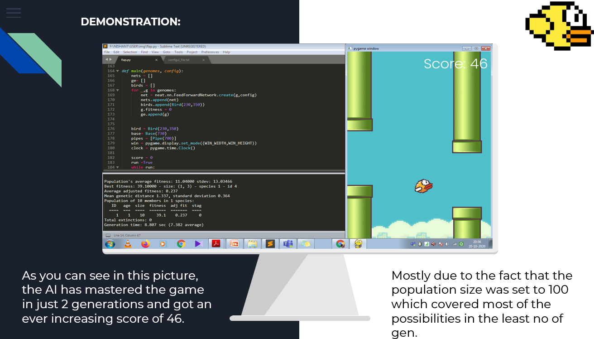
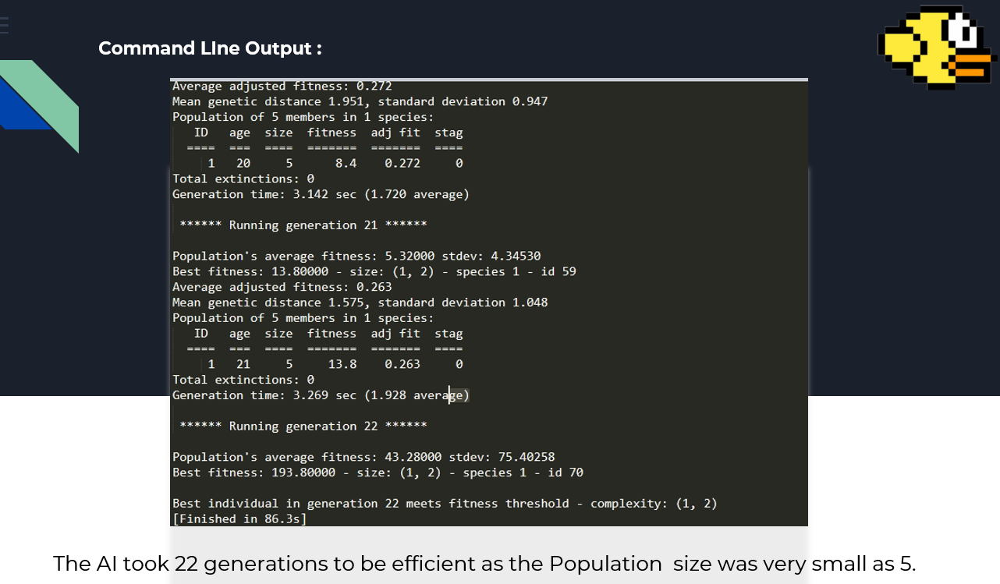

# AI_flappy_bird
Flappy bird is an extremely popular game which got popular mostly due to the fact that it was extremely tough to play and score in that game. My project tries to make that job simpler by first making the game in python using Pygame with an object-oriented approach and then playing it using AI neural evolution technology namely NEAT Algorithm. I tried to make it work with generations of evolved birds which learn from their mistakes and adapt with every gen to score more and move forward. A major part of the project revolves around making the game in python and then implementing it further for making an AI driven game 

Some Glimpse of the Project: 

Command Line OutPut: 

In order to run the game, you need to first download the entire folder in your directory. 
Once you have downloaded it, click on flap.py on your normal python console. 
In order to run the game, we need to have pygame and neat-python installed in our pc.
So, if you don't have it, go the command prompt and type pip install pygame and once it gets
downloaded, type pip install neat-python.
Once both are installed, the game will run in the game console.
PLAY!
